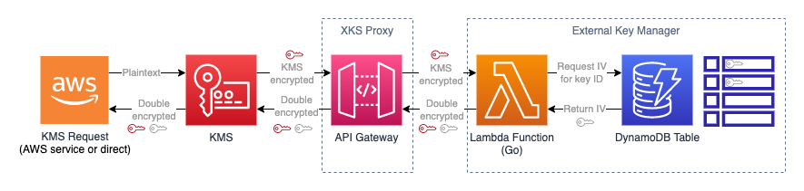

# toyxks

> Basic (toy) [External Key Store](https://docs.aws.amazon.com/kms/latest/developerguide/keystore-external.html) for AWS KMS



Obviously don't use this anywhere near production.

## Installation

You will need Go and AWS SAM locally installed before beginning.

Deploy the stack using AWS SAM:

```
sam build
sam deploy --guided
```

After deploying the above, you will receive outputs from the stack. In the KMS console, [create](https://us-east-1.console.aws.amazon.com/kms/home?region=us-east-1#/kms/custom-key-stores/external/create) a new external trust store with the value returned from the stack outputs.

Once created, open the external trust store and execute the `Connect` command. This process may take a few minutes to complete.

You should then create a KMS CMK using the external trust store as a source. The external key ID should start with the string `mock`, for example, `mockkey1`. Store the key ID of the created CMK for testing below.

## Example Usage

Execute the following to test encryption (`c2VjcmV0` is the base64-encoded value of the string `secret`):

```
aws kms encrypt --key-id 012KEYUUIDHERE-0000-0000-0000000000000 --plaintext c2VjcmV0
```

Take the value of the `CiphertextBlob` field from the previous operation and use it as below:

```
aws kms decrypt --ciphertext-blob AQIC....xyz==
```

If successful, the plaintext should return as `c2VjcmV0`.

### Using the key table

By default, if an external key store ID starting with the string `mock` is used, a hardcoded keying material is used and the key is always present. To test different keying material, and the ability to destroy the key, use the included DynamoDB table to specify new keys that don't start with the `mock` string. When manually inserting an item, the structure should be as follows:

externalkeyid (S) | secret (S)
------------------|-----------
anystring         | asecretvaluethatisexactly32long!

Ensure the secret value is exactly length 32.

## Cleanup

Delete the stack to remove the API Gateway, Lambda and DynamoDB components. Disable, then schedule for deletion any CMKs created during your testing. Once the CMKs are deleted (takes 7+ days), you can disconnect and delete the external trust store from the KMS console.
